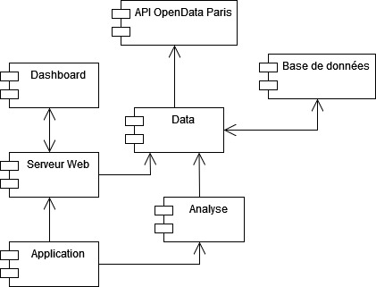

# Test The Quantic Factory

## Instruction

`python -m pip install -r requirements.txt` pour installer les dépendances.

`python app.py` dans le dossier racine pour démarrer le serveur.

Ouvrir l'adresse `http://127.0.0.1:8080` ou `http://localhost:8080` pour accéder au dashboard

## Documentation

### Spécification

### Récupération des données

Les données sont récupérées par une requête vers l'API Open Data de Paris avant d'être formatées dans un tableau avec la librairie pandas puis sauvegardées dans une base sqlite.

### Données analysées

L'analyse porte sur le temps de traitement des dossiers et la proportion à être approuvés en fonction de l'arrondissement, de la circonscription et du type de dossier déposé.

### Traitement des données

Les données sont récupérées à partir de la base de données puis filtrer pour ne garder que les informations utiles pour l'analyse en cours. Le temps de traitement et le taux d'approbation sont ensuite calculés par les algorithmes puis stocker dans des tableaux en fonction des différents critères. 
Ces tableaux sont ensuite sauvegardés dans la base de données.

### Accès aux données depuis le dashboard

Les résultats de l'analyse sont disponibles à travers une API Flask renvoyant les tableaux sauvegardés dans la base de données. Le dashboard accède à cette API par des requêtes ajax.

### Visualisation des données

Les résultats sont affichés par le dashboard à l'aide de la librairie Chart JS. Les réponses de l'API sont des tableaux à deux colonnes contenant les données à indiquer en abscisse et les valeurs associées.

